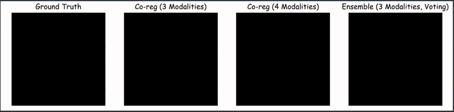

# Automatic Brain Tumour Segmentation using Co-registered data and Ensembles of Specialsied Learners

This is a machine learning project focused on brain tumour segmentation using models trained on co-registered data and ensembles of specialsied learners over the BraTS 2019 data set. It implements a 3D U-Net and uses this as the network architecture for all models. 

## Pre-requists:
#### 1. Data
Sign up at this site https://ipp.cbica.upenn.edu/#click-people-apply, wait for confirmation and download the BraTS 2019 training data set
#### 2. Python v3.6.9. Package dependencies:
    a. Cuda version 10
    b. Tensorflow 1.14.0
    c. Keras 2.3.1
    d. SimpleITK 1.2.0
    d. Matplotlib 3.1.1
    e. Medpy 0.3.0
    f. Numpy 1.17.3

## Usage
As a machine learning project there are multiple parts to the implemeted system. Below are details for each part.

#### 1. Pre-processing:
    a. Bias Field Correction
    python bias_field_correction.py parent_hgg_data_dir_path parent_lgg_data_dir_path bias_field_correction_output_dir_path

    b. Co-registration, Normalisation and Centeral cropping
    Note: number_of_modalities should be 3 or 4
    python coreg_and_normalisation.py number_of_modalities bias_field_corrected_data_path output_dir_path

#### 2. Model Training:
    a. General model training script.
    python general_training_script.py training_data_dir ground_truth_data_dir output_file_name output_dir_path

#### 3. Evaluation:
    Note: Trained models can be found at: https://www.dropbox.com/sh/2lts40lcv5o92k7/AAAkkl5441te9ruNrkWLO7wia?dl=0
    
    a. Co-reg Model
    Note: num_modalities should be 3 or 4
    python coreg_inference.py num_modalities ground_truth_data_dir test_data_directory_path trained_model_hdf5_file_path prediction_output_dir_path

    b. Ensemble Models
    python ensemble_inference.py ground_truth_data_dir t1_data_dir_path t1c_data_dir_path t2_data_dir_path flair_data_dir_path agg_4_output_path agg_3_output_path voting_4_output_path voting_3_output_path

    Note: Jupyter Notebook Ensemble Inference.ipynb can be run instead after changing paths appropriately

#### 4. Visualiser
    python slice_visualiser.py patient_file_name ground_truth_data_dir model_one_prediction_dir_path model_two_prediction_dir_path model_three_prediction_dir_path